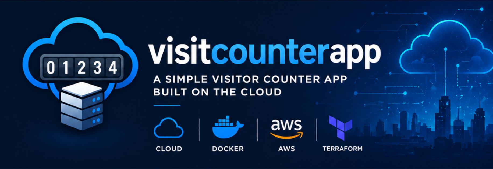

# 🚀 Visitor Counter App

Production-ready cloud application deployed on AWS with a full DevOps workflow, including HTTPS, custom domain, load balancing and auto scaling.

---

## 🌐 Live Demo

👉 https://visitcounterapp.com

---

## 📌 Project Overview

This project demonstrates how to design, build and deploy a scalable backend service using modern cloud and DevOps practices.

The application exposes a simple API that tracks the number of visits using Redis as a persistent store, served through a fully managed cloud infrastructure.

---

## 🧱 Architecture

```text
Client (Browser)
        │
        ▼
HTTPS (ACM Certificate)
        │
        ▼
Application Load Balancer (AWS)
        │
        ▼
Auto Scaling Group (EC2 instances)
        │
        ▼
Docker container (Flask backend)
        │
        ▼
Redis (AWS ElastiCache)
```

---

## ⚙️ Tech Stack

| Layer            | Technology                |
| ---------------- | ------------------------- |
| Backend          | Python (Flask)            |
| Database         | Redis (ElastiCache)       |
| Containerization | Docker                    |
| Cloud            | AWS (EC2, ALB, ASG, ACM)  |
| IaC              | Terraform                 |
| CI/CD            | GitHub Actions            |
| Domain & HTTPS   | Custom domain + SSL (ACM) |

---

## ✨ Key Features

* REST API with visit counter (`/visits`)
* Health check endpoint (`/health`)
* Stateless backend architecture
* Redis-based persistence
* Dockerized application
* Infrastructure provisioned with Terraform
* Load balancing with AWS Application Load Balancer
* Auto Scaling Group for high availability
* HTTPS enabled with custom domain (`visitcounterapp.com`)
* Zero-downtime deployments using Instance Refresh

---

## 🚀 Deployment Workflow

1. Code is pushed to GitHub
2. GitHub Actions builds the Docker image
3. Image is pushed to Docker Hub
4. EC2 instances pull the latest image automatically
5. Auto Scaling Group manages instance lifecycle
6. Load Balancer routes HTTPS traffic to healthy instances

---

## 🔄 CI/CD Pipeline

Current:

* Docker image build
* Push to Docker Hub

Next step:

* Trigger Auto Scaling Instance Refresh automatically after each deployment

---

## 📁 Project Structure

```text
cloudproject/
├── backend/
│   ├── backend.py
│   ├── Dockerfile
│   ├── requirements.txt
│   ├── static/
│   │   ├── navigator_logo.png
│   │   ├── preview.png
│   │   └── web_logo.png
│   └── templates/
├── terraform/
│   ├── main.tf
│   └── user_data.sh
└── README.md
```

---

## 📸 Preview



---

## 🧠 Engineering Decisions

### Why Redis?

* In-memory storage → extremely fast
* Ideal for counters
* Managed service (ElastiCache) reduces operational overhead

### Why HTTPS + Custom Domain?

* Real production setup
* Secure communication (SSL/TLS)
* Professional deployment (not raw IP)

### Why Auto Scaling Group?

* Eliminates manual EC2 management
* Provides high availability
* Enables rolling updates with zero downtime

### Why Terraform?

* Infrastructure reproducibility
* Version-controlled cloud configuration
* Prevents configuration drift

### Why Docker?

* Consistent execution environment
* Simplifies deployment process
* Enables CI/CD automation

---

## 📊 What This Project Demonstrates

* End-to-end cloud deployment
* Infrastructure as Code (IaC)
* Containerized backend services
* Load balancing and horizontal scaling
* HTTPS configuration with ACM
* Domain-based production deployment
* CI/CD pipeline fundamentals

---

## 🔮 Future Improvements

* Fully automated deployments (CI/CD → ASG refresh)
* Blue/Green deployments
* Monitoring with CloudWatch dashboards
* Centralized logging
* Rate limiting / API protection
* CDN (CloudFront)

---

## 👤 Author

**Marc Ropero Soberbio**

Cloud & DevOps Engineer (in progress) focused on building real-world infrastructure projects.

---

## 📄 License

MIT License
